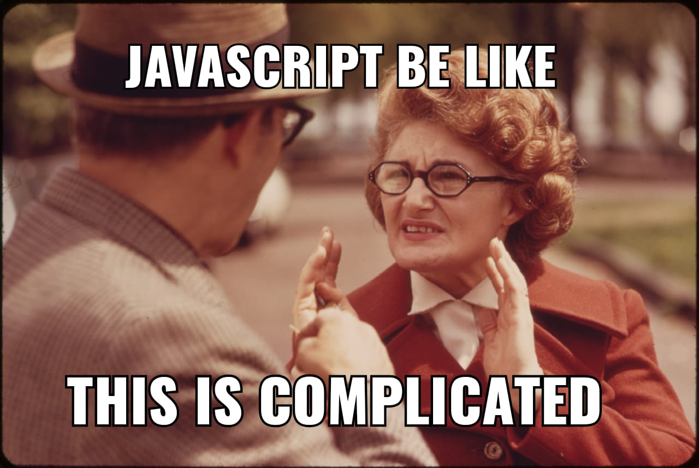

# Conceptos básicos de JavaScript y CSS que me hubiera gustado aprender en la escuela
No me malentiendan, aprendí mucho en la escuela. Desarrollo de Aplicaciones Web fue una materia de la que muchos compañeros se enamoraron, y sin ella no sabría jugar con el DOM, qué es Ajax, fundamentos de php, etc.

Es de esperar que en un curso no intensivo de 6 meses haya poco espacio para adentrarse en detalles y truquitos de cada lenguaje. El lado positivo es que todavía se cuenta con el resto de una vida para aprenderlos, y tener buenos compañeros de trabajo ayuda dramáticamente.

Todavía estoy muy lejos de ser un experto, pero al menos puedo hablar de lo siguiente:

### ¿Flechas?
La primera vez que vi un símbolo de igual junto al "mayor que" creí que era un operador lógico. Leía y releía los `=>` pero nada tenía sentido. Entonces lo encontré, aquel video de YouTube que decía _eso es una función flecha_, y desde ese entonces no he parado de usar tan conveniente notación.
#### Más que un sustituto de _`function`_

#### Retorno implícito

### No es necesario sumar cadenas

### Los objetos en JavaScript son más especiales de lo que aparentan

### ¿Cómo se posiciona un elemento encima de otro?
He aquí la parte de CSS que prometí en el título

### Mi relación amor-odio con ESLint

## Un último comentario
Hay muchos conceptos que los programadores senior deben dominar, y estoy seguro de no conocer ni un cuarto de ellos. Saber usar un lenguaje no lo es todo, también hay que estar enterado de cosas como modularidad, buenas prácticas, principios SOLID, etc. A veces me siento algo tonto, pero a fin de cuentas es difícil ser un buen desarrollador. Para concluir este artículo, no puedo sino alentarlos a seguir ampliando su base de conocimiento.