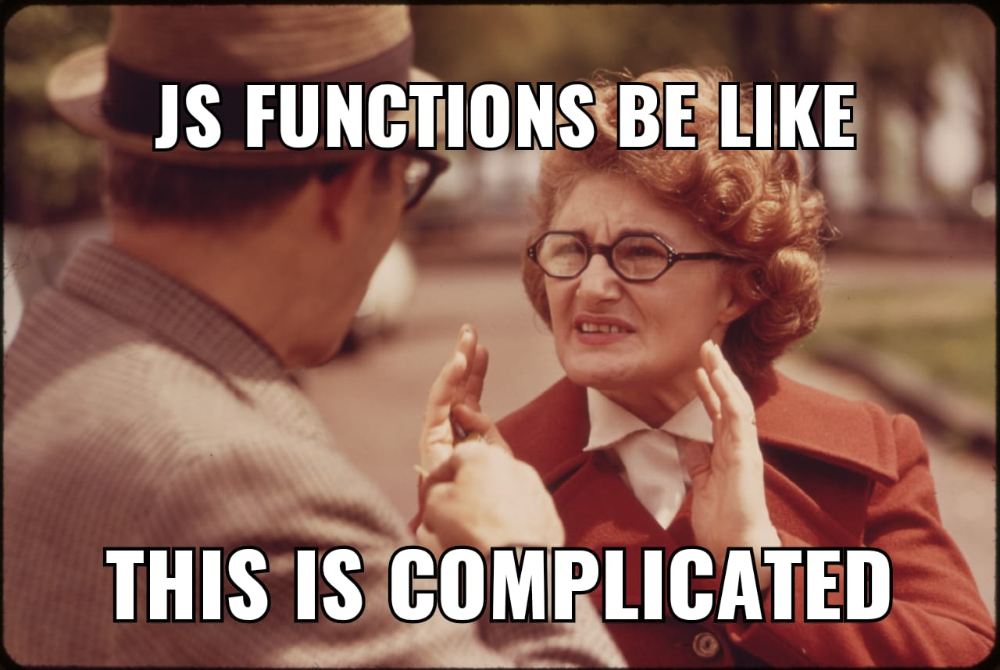

# Conceptos de JavaScript y CSS que me hubiera gustado aprender en la escuela
No me malentiendan, aprendí mucho en la facultad. Desarrollo de Aplicaciones Web fue una materia de la que muchos compañeros se enamoraron, y sin ella no sabría jugar con el DOM, qué es Ajax, fundamentos de php, etc.

Es de esperar que en un curso no intensivo de 6 meses haya poco espacio para adentrarse en detalles y truquitos de cada lenguaje. El lado positivo es que todavía se cuenta con el resto de una vida para aprenderlos, y tener buenos compañeros de trabajo ayuda dramáticamente.

### No es necesario sumar cadenas
Bueno, este apartado será corto. Dudaba si designarle todo un subtítulo a las **Template literals** (o template strings), pero no podía dejar de lado a uno de mis trucos favoritos de ES6+. Estas dos líneas son equivalentes:
```javascript
'Bienvenido ' + nombre + ', son las ' + (new Date().getHours() + 1) + ' horas';

`Bienvenido ${nombre}, son las ${new Date().getHours() + 1} horas`;
```
Al usar acentos graves `` ` `` se pueden agregar expresiones dentro de un `${}`, evitando concatenar cadenas y expresiones.

### ¿Flechas?
La primera vez que vi un símbolo de igual junto al "mayor que" creí que era un operador lógico. Leía y releía los `=>` pero nada cobraba sentido. Entonces lo encontré, aquel video de YouTube que decía _eso es una función flecha_, y desde ese entonces no he parado de usar tan conveniente notación.
#### Sintaxis
La sintaxis (simplificada) de una función anónima es `function(<argumentos>) {<cuerpo>}`. La sintaxis equivalente para la función flecha es `(<argumentos>) => {<cuerpo>}`, pero la segunda tiene un poquito más de azúcar.
+ **Paréntesis opcionales.-** Si la función flecha recibe un solo argumento y éste no [se desestructura](https://developer.mozilla.org/es/docs/Web/JavaScript/Referencia/Operadores/Destructuring_assignment "Asignación Desestructurante - JavaScript | MDN"), se pueden omitir los paréntesis en el argumento. Es decir, `(<argumento>) => {<cuerpo>}` equivale a `<argumento> => {<cuerpo>}`.
+ **Retorno implícito.-** Si el cuerpo la función flecha solo consta de retornar un resultado, eliminar los corchetes hará que el `return` sea implícito. Es decir, `(<argumentos>) => {return <expresión>}` equivale a `(<argumentos>) => <expresión>`.

Por ejemplo: se tiene un arreglo con números, y se desea saber cuáles son mayores a 3. Usemos al conocido método `Array.prototype.filter()`. Por si no habías escuchado de él, _crea un nuevo array con todos los elementos que cumplan la condición implementada por la función dada_ (Copypasteado de [MDN](https://developer.mozilla.org/es/docs/Web/JavaScript/Referencia/Objetos_globales/Array/filter "Array.prototype.filter() - JavaScript | MDN")).
```javascript
const numbers = [5, 8, 1, 0, 10, -4];

const usingFunction = numbers.filter(function(number){
  return number > 3
});

const usingArrow = numbers.filter(number => number > 3);

// Tanto usingFunction como usingArrow serán [5, 8, 10]
```

#### Más que un sustituto de `function`
Voy a plantear un problema antes de decir dónde entran las `=>`. Se quiere llamar a una promesa estando dentro de un objeto, y se desea almacenar en el mismo objeto algún valor que diga si la promesa se cumplió o no. Por motivos de simplicidad, la promesa en cuestión se llamará _somePromise_ y no diremos qué hace.
```javascript
const obj = {
  promiseSuccessful: false,
  someMethod() {
    somePromise().then(function() {
      this.promiseSuccessful = true;
    });
  }
};
obj.someMethod();
```
Uno podría pensar que el valor de `obj.promiseSuccessful` sea `true` si la promesa es exitosa, pero [la manera en que this funciona](https://medium.com/better-programming/understanding-the-this-keyword-in-javascript-cb76d4c7c5e8 "Understanding the “this” Keyword in JavaScript - Better Programming - Medium") hace que este no sea el caso, porque el `this` de la función anónima apunta a un _this global_ en lugar de a `obj`.

Conozco dos soluciones. Una es no usar `this` dentro de la función anónima.
```javascript
// ...
  someMethod() {
    const self = this;
    somePromise().then(function() {
      self.promiseSuccessful = true;
    });
  }
// ...
```
La otra solución es usar una función flecha. La **característica más distintiva** de este tipo de funciones es que su `this` apunta al mismo `this` donde fue declarada.
```javascript
// ...
  someMethod() {
    somePromise().then(() => {
      this.promiseSuccessful = true;
    });
  }
// ...
```

#### Cuándo no usarlas
Si al crear un objeto usas las funciones flecha para declarar sus métodos, el `this` de tales métodos no va a apuntar al objeto, sino al `this` del lugar donde se creó. Por ejemplo: las siguientes líneas tienen un problema muy similar al que teníamos inicialmente. Debido al uso de `=>` al declarar `someMethod`, el `this` hace referencia al lugar donde se creó `obj`, no al mismo `obj`.
```javascript
const obj = {
  promiseSuccessful: false,
  someMethod: () => {
    somePromise().then(() => {
      this.promiseSuccessful = true;
    });
  }
};
```



### Los objetos en JavaScript son más especiales de lo que aparentan

### ¿Cómo se posiciona un elemento encima de otro?
He aquí la parte de CSS que prometí en el título

## Un último comentario
Hay muchos conceptos que los programadores senior deben dominar, y estoy seguro de no conocer ni un cuarto de ellos. Saber usar un lenguaje no lo es todo, también hay que estar enterado de cosas como modularidad, buenas prácticas, principios SOLID, etc. A veces me siento algo tonto, pero a fin de cuentas es difícil ser un buen desarrollador. Para concluir este artículo, no puedo sino alentarlos a seguir ampliando su base de conocimiento.